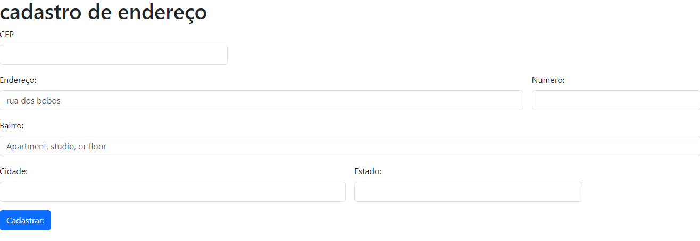

# form-CadEndereco
criamos esse codigo para uma pagina de cadastro de endereço como um aplicativo de compra na internet pra você ter uma entrega você precisaria preencher todo esse cadastro de endereço, como cep, numero, rua, cidade, bairro etc...
 
adicionamos o link de ligação no javascript, e dentro do javascript adicionamos strict mode

# site do codigo
esse codigo foi retirado do boostrap
# modificaçõe
 mudamos texto, 